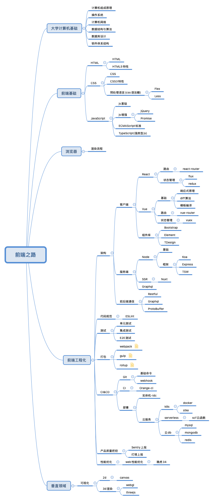

# 个人前端知识体系

## 为什么选择前端
&nbsp;&nbsp;大一大二的时候随大流学着计算机基础，也没有加实验室，虽然不算浑浑噩噩，但是也没有什么职业规划。大三上升大三下的那个假期，面临着下学期要开始找实习的压力，必须确定一个工作方向。因为之前跟 YXT 学长做过一个小网站，对前后端都有一点了解，于是就在这两个方向上抉择。挣扎了一个礼拜后，最后选择前端，一是感觉比较酷炫，二是听说入门比较快。

## 成长过程记录
### 第一阶段 大三上暑假(2018年1月底～3月底)&nbsp;前端入门：html(5) + css(3) + js
&nbsp;&nbsp;入门阶段对我来说是比较痛苦的，身边没有学长和同学从事该方向，只能靠自己野蛮生长。虽然看完了 w3c 的教程，但还是感觉自己好像什么都不会。无奈之下，花了 1K 在慕课网上买了两个教程(前端小白入门系列课程 和 前端进阶：响应式开发与常用框架)。  
&nbsp;&nbsp;看完之后，基本掌握了切页面的技能。但 js 基础还是太薄弱了，就去拜读了红宝书(《js高级程序设计》)。
### 第二阶段 2018年4～6月 春招+学习 React 框架
(1)React：当时我学习一个技术点一般分三步 - 一是看教程入门，二是找实战教程学一下，三是了解下底层原理。  
&nbsp;&nbsp;1)React 入门：阮一峰的 React 入门实例教程，React 官方文档。  
&nbsp;&nbsp;2)React 实战：慕课实战教程- React 高级实战 打造大众点评 WebApp，程墨的《深入浅出 React 和 Redux》  
(2)春招：  
&nbsp;&nbsp;我的春招基本就是不断受挫的过程，所有面试几乎都是一面挂(光腾讯就挂了三次)，但是自己心态还算平稳，知道自己入门晚，那就一步一步慢慢来。  
&nbsp;&nbsp;当时整个春招的状态就是白天在牛客上看面经和面试，晚上做各个公司的笔试。所幸在春招的末尾，收获华为和小米的 offer，毅然前往北京小米实习了。
### 第三阶段 2018年7～9月中旬 小米mui国际部实习
&nbsp;&nbsp;2018年7月2号，入职小米实习。当天就被排进了一个新项目-基于vue的WebApp项目，嵌套在国际版小米浏览器的信息流中，做今年亚运会活动的推广。    
&nbsp;&nbsp;由于是第一次实习，加上之前没接触过 vue，前几天就处于很紧绷的状态。后来跟带我项目的FWH沟通了一下，了解到需求并不是很赶，慢慢学就好了(实习沟通很重要，不要一个人憋着)。  
&nbsp;&nbsp;就这样学习了新的框架Vue，做了人生第一个线上项目，接触到了一个项目从 需求评审->商定接口文档->开发->联调->打包->测试->最终上线维护 的全过程。另一方面，实习期间业务并不是很重，让我有时间去研究框架的底层实现，而这一段时间的沉淀，也为我后续的秋招增加了不少底气。  
实习期间读完的书：  
 - 阮一峰的《ES6入门》
 - 《vuejs实战》
 - 《剖析Vue.js内部运行机制》
 - vue技术内幕(博客) - vue2.x版本
 - 《Promise迷你书》
 - 《你不知道的JS》
 - 《深入浅出Node.js》
 - 《图解http》
### 第四阶段 2018年8～10月 秋招
&nbsp;&nbsp;七月底，各大公司的提前批就已经陆续开始了。自己也进入了不断地投简历面试的状态。此时与春招最大的改观就是心态沉稳了许多，更多地是抱着交流的心态去接触面试官(而不是以前那种要去征服面试官的浮躁)。凭着985本+大厂实习+还算扎实的基础，秋招的面试基本都能进入到第二轮，至于能不能拿到offer，也跟运气有关，不用去强求，放平心态就好。  
&nbsp;&nbsp;秋招面试一般是这样的：  
&nbsp;&nbsp;一面：前端基础，计算机基础(计网考察的多)，有的公司还会考察手撕代码。  
&nbsp;&nbsp;二面：考察项目经历(为什么用这个技术栈，底层原理了解么)，以及根据场景给解决方案。  
&nbsp;&nbsp;三面：一般面试官都是大leader，比较看眼缘，遇到过问智力题和职业规划的。    
&nbsp;&nbsp;以下是秋招的战果：一共投了60家公司，面试了20家，过了8家。  
|公司|结果|
|:-|:-:|
|华为优招|两轮技术面，offer。|
|快看漫画|四轮技术面 一轮hr。offer。|
|一点咨询|四轮技术面 一轮hr。offer。|
|有赞|三轮技术面 一轮hr。offer。|
|shopee|两轮技术面，offer。|
|老虎证券|两轮技术面，offer。|
|地平线|四轮技术面 一轮hr。offer。|
|网易|提前批投的邮件事业部，未去面试。正式批投的杭研，调到考拉。offer。|
|搜狗|三面技术面。|
|快手|三面技术面。|
|百度|凤巢二面挂，智能云一面挂。正式批面试拒了。|
|远算科技|二面挂。|
|今日头条|二面挂。|
|腾讯云|二面挂。|
|爱奇艺|提前批二面挂。正式批笔试后无反馈。|
|趣店|二面鸽。|
|京东金融|一面挂。|
|中国银联|一面挂。|
|猿辅导|一面挂。|
|小米|一面挂。|
|拼多多|笔试挂。|
|贝壳|笔试挂。|
|小红书|笔试挂。|
|搜狐|简历挂。|
|阿里巴巴|简历挂。国际事业部。|
|携程|投递后无反馈。|
|蘑菇街|投递后无反馈。|
|OPPO|投递后无反馈。|
|唯品会|投递后无反馈。|
|马蜂窝|投递后无反馈。|
|猫眼电影|投递后无反馈。|
|阅文|投递后无反馈。|
|映客直播|投递后无反馈。|
|作业帮|投递后无反馈。|
|上海微盟|投递后无反馈。|
|4399|投递后无反馈。|
|金山WPS|投递后无反馈。|
|360健康|投递后无反馈。|
|360|投递后无反馈。|
|知乎|投递后无反馈。|
|虎牙直播|投递后无反馈。|
|微众银行|投递后无反馈。|
|多益网络|投递后无反馈。|
|斗鱼|投递后无反馈。|
|Face|投递后无反馈。|
|新浪|笔试后无反馈。|
|滴滴|笔试后无反馈。|
|美团|笔试后无反馈。|
|好未来|未去面试。|
|迅雷|未去面试。|
|苏宁|未去面试。|
|58|未去面试。|
|顺丰|未去面试。|
|珍爱网|未去面试。|
|去哪儿|未笔试。|
|YY|未笔试。|
|CVTE|未笔试。|
|网易雷火|未笔试。|
|Keep|未笔试。|
|陌陌|未笔试。|

### 第五阶段 2018年11月-19年2月 网易考拉 pop 组实习 + 腾讯补招
&nbsp;&nbsp;2018年11月，正式入职网易考拉实习。刚入职的感受就是组里的人都异常忙碌，每个人都跟进着两三个项目，leader 也说过几天要让我单独负责一个中后台项目。压力山大，一方面是因为接手的这个项目之前的负责人已经离职了，只能自己去慢慢理解业务；另一方面是因为之前没有单独负责过项目，怕出问题。在经过几天的思想斗争之后，还是选择和 leader 进行沟通。所幸 leader 人很好，给安排了 mentor，带着我梳理了下业务，再加上自己之后几天的摸索，终于慢慢理清了整个项目。  
&nbsp;&nbsp;经过了差不多一个月的适应期之后，慢慢的适应了我们组的工作节奏，已经可以单独负责三个中后台项目了(ucc, spiderman, mirana)。  
腾讯补招：  
&nbsp;&nbsp;在实习期间，收到了腾讯补招的信息，就抱着再试试的心态投递了。再经历了三次技术面和两次 hr 面后，很幸运的拿到了 pcg-qq 空间的 offer。
### 第六阶段 2019年5月 重回前端学习
&nbsp;&nbsp;毕设差不多弄完了，继续回归前端学习。  
&nbsp;&nbsp;五月份跟着慕课网实战教程，完成了美团PC端官网。  
&nbsp;&nbsp;技术栈为vue(elementUI) + nuxt + koa + redis + mongodb
### 第七阶段 2019年7月至今 入职鹅厂
&nbsp;&nbsp;截止至2020年1月，以校招生的身份在鹅厂工作了半年。主要做了以下几件事：  
 - 接手了 QQ 小程序三个管理端的需求。
 - 为运营管理端接入 Sentry 系统，监控用户使用时前端层面的报错。
 - 为开发者管理端接入 Monitor 系统，自制工具，监控 node层 所有 pb 接口的运行。
 - pcg mini 项目：闪光的我 - 微信小程序
 - 配合 2019 tweb 大会，采访阿里水澜-rax(serverless ssr)
 - 搭建管理端 vue 组件库，提升后期管理端需求开发效率。
 - 研究 protobuf 校验工具，封装成 ci 插件，解决目前业务中未对提交的 pb 文件进行校验的痛点。
 - 四次组内分享：GraphQL，mini 项目研发，1113 发布故障小结，SCF 探索。
 - 沉淀了 12 篇 KM 文章：
   - GraphQL 
   - Sentry 上报接入
   - monitor 监控接入
   - tsw 与业务代码的交互逻辑
   - node 层使用 protubuf
   - pbLint - 从小工具到oci插件
   - 自制 vue 组件库
   - 简析 orange-ci 工作流
   - 1113 织云包发布故障小结
   - 探索 docker 本质
   - scf 使用初探
 - 为 oci 做 12 月的 epc 举证。

&nbsp;&nbsp;感觉这段时间，收获满满。看到了和大佬们的差距，也逐渐喜欢上了写代码的过程。下一个半年，先试着在 node 这条路上走走。
