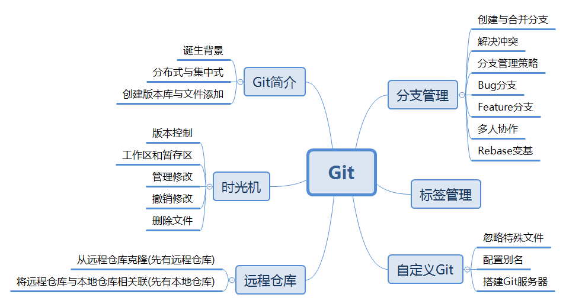
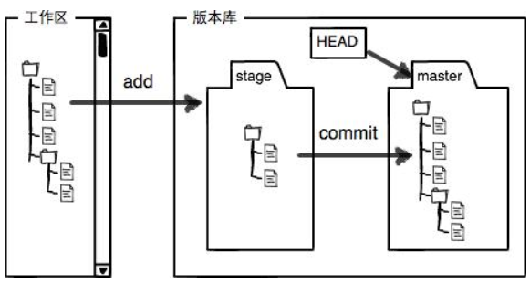
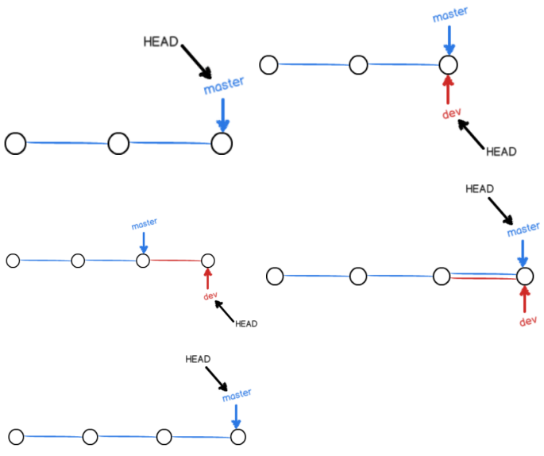
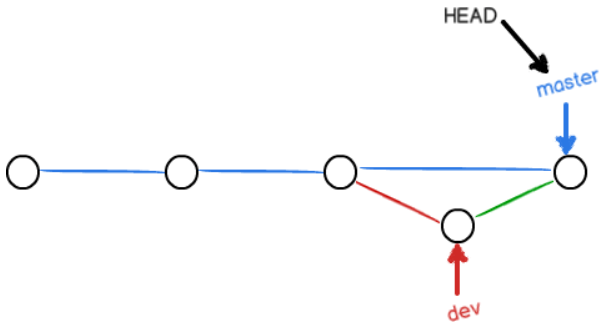
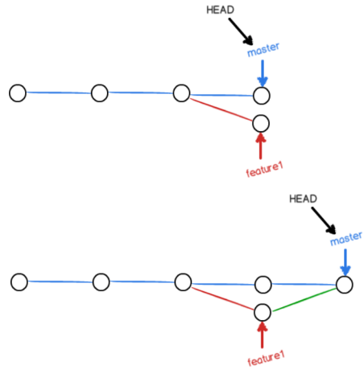
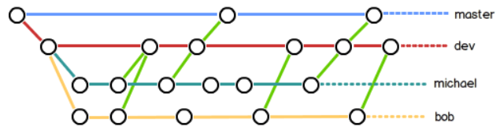

## Git - 分布式版本控制系统
### 一、[Git简介](#gjj)
* [诞生背景](#gjj1)
* [分布式与集中式](#gjj2)
* [创建版本库与文件添加](#gjj3)
### 二、[时光机](#sgj)
* [版本控制](#sgj1)
* [工作区和暂存区](#sgj2)
* [管理修改](#sgj3)
* [撤销修改](#sgj4)
* [删除文件](#sgj5)
### 三、[远程仓库](#ycck)
* [从远程仓库克隆(先有远程仓库)](#ycck1)
* [将远程仓库与本地仓库相关联(先有本地仓库)](#ycck2)
### 四、[分支管理](#fzgl)
* [创建与合并分支](#fzgl1)
* [解决冲突](#fzgl2)
* [分支管理策略](#fzgl3)
* [Bug分支](#fzgl4)
* [Feature分支](#fzgl5)
* [多人协作](#fzgl6)
* [Rebase变基](#fzgl7)
### 五、[标签管理](#bqgl)
### 六、[自定义Git](#zdyg)
* [忽略特殊文件](#zdyg1)
* [配置别名](#zdyg2)
* [搭建Git服务器](#zdyg3)
---
# Git - 分布式版本控制系统
## Git简介
### 诞生背景
linux团队为管理linux代码而研发的一套分布式版本控制系统。
### 分布式与集中式
集中式需要有一台机器来充当中央服务器，而分布式则不需要，每台主机都保留完整的代码库。
### 创建版本库与文件添加
新建版本库：git init 
添加到暂存区：git add file_name 
提交到版本库：git commit -m "message"
## 时光机
查看版本库状态：git status 
查看文件状态：git diff file_name
### 版本控制
版本回退： 
查看历史提交记录：git log 
修改HEAD指向：git reset --hard commit_id 
版本前进： 
查看命令历史记录：git reflog 
修改HEAD指向：git reset --hard commit_id 
PS：HEAD表示当前版本，HEAD^表示上一个版本，HEAD~3表示上三个版本。
### 工作区和暂存区
 
### 管理修改
Git跟踪并管理的是修改，而非文件。
### 撤销修改
撤销当前**工作区**的修改，回到最近一次git add或git commit的状态：git checkout -- file_name 
重置当前工作区版本，并清空**暂存区**：git reset HEAD file_name
### 删除文件
rm file_name 
从版本库中删除文件：git rm file_name(之后的恢复只能选择版本回退) 
恢复误删文件到最新版本：git checkout -- file_name
## 远程仓库
本地Git仓库和GitHub仓库之间的传输是通过SSH加密的，所以需要把本地的SSH公钥添加到github上，用户才有添加代码的权限。
### 从远程仓库克隆(先有远程仓库)
克隆：git clone git@github.com:best921/originProperty.git
### 将远程仓库与本地仓库相关联(先有本地仓库)
关联：git remote add origin git@github.com:best921/originProperty.git
## 分支管理
 
### 创建与合并分支
查看分支：git branch 
新建分支：git branch branch_name 
新建远程分支到本地：git checkout -b branch_name origin/branch_name 
删除分支：git branch -d branch_name 
强制删除分支(适用于还没被合并的分支)：git branch -D branch_name 
切换分支：git checkout branch_name 
新建+切换分支：git checkout -b branch_name 
合并指定分支到当前分支(默认Fast-forward模式)：git merge branch_name 
普通模式的分支合并，会新建一个commit记录：git merge --no-ff -m "" branch_name
 
### 解决冲突
 
把Git合并失败的文件手动编辑为我们希望的内容，再提交。 
查看分支合并图：git log --graph --pretty=oneline --abbrev-commit
### 分支管理策略
master分支：应该是非常稳定的，也就是仅用来发布新版本，平时不能在上面干活。 
dev分支：不稳定的，在该分支开发，到某个时候，比如1.0版本发布时，再把dev分支合并到master上，在master分支发布1.0版本。
 
### Bug分支
储藏当前工作现场：git stash 
新建临时分支修复Bug，合并并删除分支。 
查看储藏的工作现场列表：git stash list 
恢复工作现场：git stash apply stash_id 
删除储藏的工作现场：git stash drop stash_id 
恢复工作现场同时删除stash内容：git stash pop
### Feature分支
当我们接到一个新功能需求时，最好新建一个feature分支，在上面开发，完成后，合并，最后，删除该feature分支。
### 多人协作
查看远程库信息：git remote 
查看远程库详细信息：git remote -v 
推送到远程分支：git push origin branch_name 
抓取远程分支最新提交：git pull branch_name 
创建本地分支和远程分支的链接关系：git branch --set-upstream-to=origin/branch_name branch_name
### Rebase变基
把本地未push的分叉提交历史整理成直线，看上去更直观：git rebase 
只对**尚未推送或分享给别人的本地修改**执行变基操作清理历史。 
从不对**已推送至别处的提交**执行变基操作。
## 标签管理
Git的标签是版本库的快照，其实就是指向某个commit的指针，通常用来标记版本号。 
新建标签(默认commit_id为最新提交的记录)：git tag tag_name commit_id 
创建带有说明的标签：git tag -a tag_name -m "xxx" commit_id 
查看标签(按字母排序)：git tag 
查看标签详情：git show tag_name 
删除本地标签：git tag -d tag_name 
删除远程标签：git push origin :refs/tags/tag_name 
推送某个标签到远程：git push origin tag_name 
推送所有标签到远程：git push origin --tags
## 自定义Git
### 忽略特殊文件
在Git工作区的根目录下创建一个特殊的.gitignore文件，然后把要忽略的文件名填进去，Git就会自动忽略这些文件，即不会报Untracked files... 
不需要从头写.gitignore文件，GitHub已经准备了各种配置文件，只需要组合一下就可以使用了。所有配置文件可以直接浏览：https://github.com/github/gitignore
### 配置别名
通过命令行配置：git config --global alias.st status 
通过配置文件修改：每个仓库的Git配置文件都放在.git/config文件中，而当前用户的Git配置文件放在用户主目录下的一个隐藏文件.gitconfig中 
PS：配置Git的时候，加上--global是针对当前用户起作用的，如果不加，那只针对当前的仓库起作用。
### 搭建Git服务器
既不想公开源代码，又不想给GitHub付费，可以自己搭建一台Git服务器作为私有仓库使用。
---
## 参考资料
[廖雪峰的git教程](https://www.liaoxuefeng.com/wiki/0013739516305929606dd18361248578c67b8067c8c017b000) 
[官方git文档](https://git-scm.com/book/zh/v2)