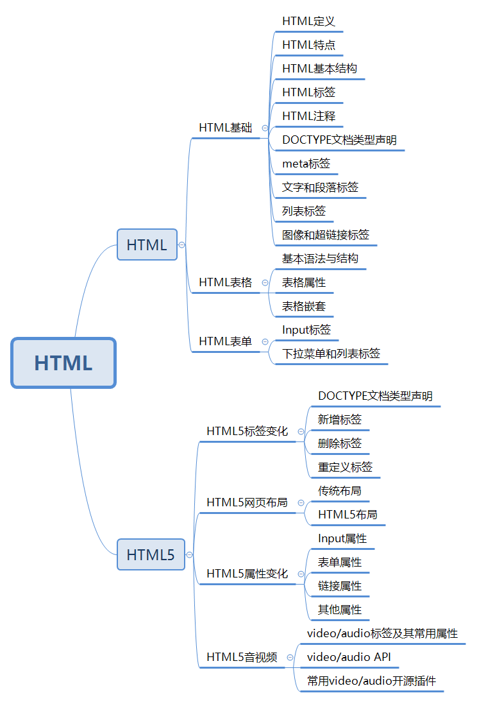

## HTML
### 一、HTML基础
* HTML定义
* HTML特点
* HTML基本结构
* HTML标签
* HTML注释
* DOCTYPE文档类型声明
* meta标签
* 文字和段落标签
* 列表标签
* 图像和超链接标签
### 二、HTML表格
* 基本语法与结构
* 表格属性
* 表格嵌套
### 三、HTML表单
* Input标签
* 下拉菜单和列表标签
## HTML5
### 一、HTML5标签变化
* DOCTYPE文档类型声明
* 新增标签
* 删除标签
* 重定义标签
### 二、HTML5网页布局
* 传统布局
* HTML5布局
### 三、HTML5属性变化
* Input属性
* 表单属性
* 链接属性
* 其他属性
### 四、HTML5音视频
* video/audio标签及其常用属性
* video/audio API
* 常用video/audio开源插件